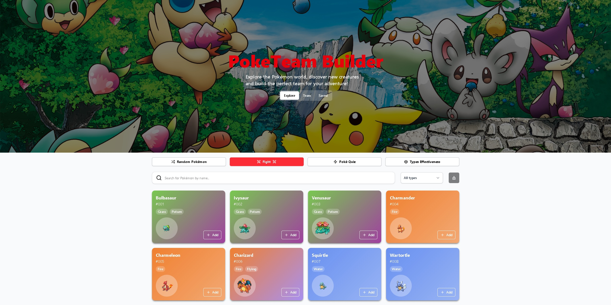
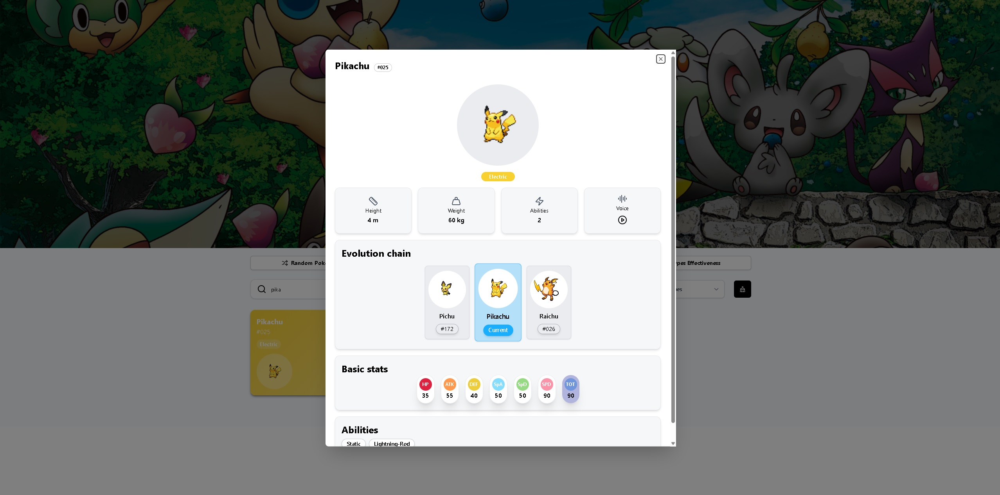
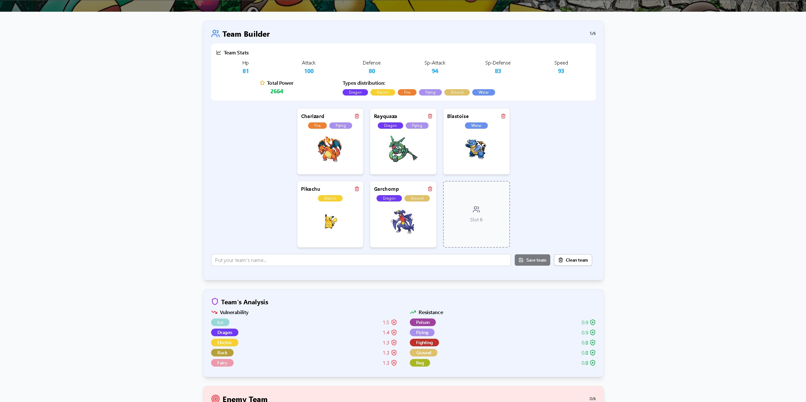
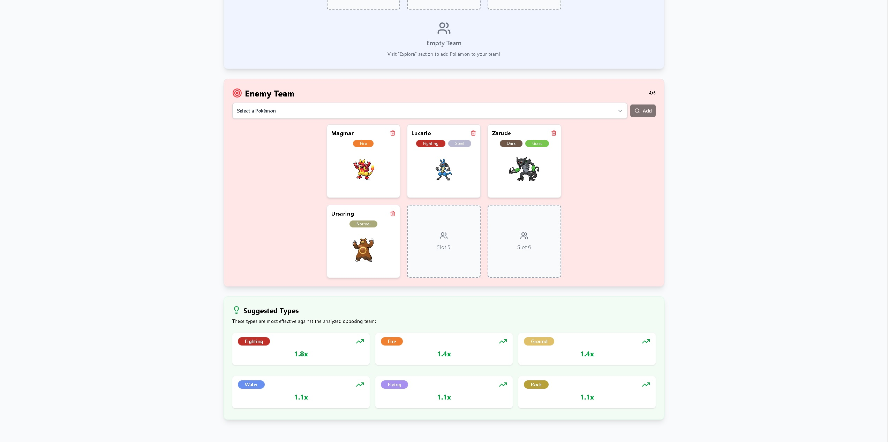
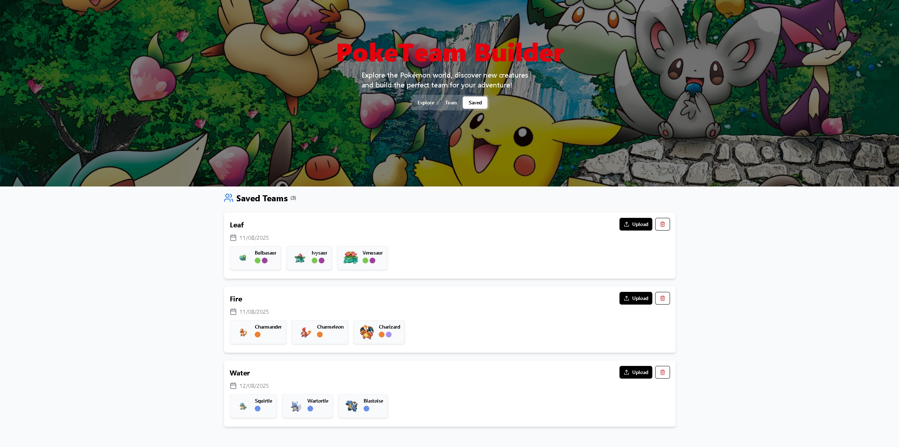
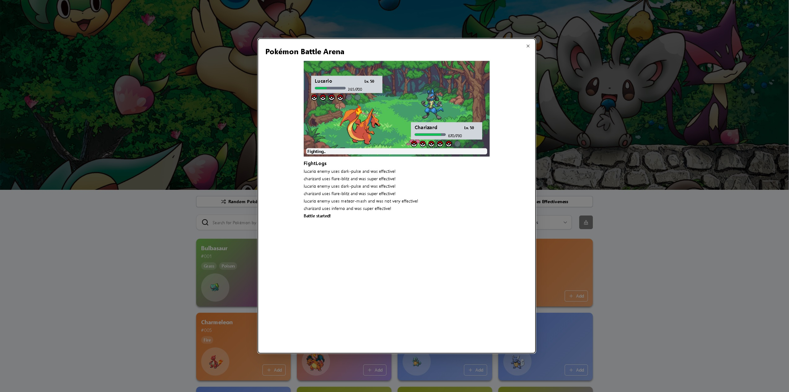

# Poké Team Builder

[](https://react.dev/)
[](https://tailwindcss.com/)
[](https://poke-team-builder-eight.vercel.app/)

---

**Poké Team Builder** è un'applicazione web interattiva progettata per aiutare gli allenatori Pokémon a creare, pianificare e ottimizzare i propri team competitivi. L'applicazione offre un'interfaccia moderna e intuitiva per esplorare il mondo Pokémon, analizzare statistiche, l'efficacia dei tipi e costruire squadre bilanciate per battaglie competitive o avventure nel mondo Pokémon.

All'interno dell'applicazione è possibile costruire le proprie squadre Pokémon e salvarle in locale per poi riprenderle, ed è inoltre possibile testarle in una **battaglia Pokémon** emulata contro una squadra avversaria.

Si possono mettere alla prova le proprie conoscenze sul mondo Pokémon tramite i quiz con domande casuali su diversi aspetti legati a questi o apprenderne di nuove tramite la modalità random che restituisce le informazioni di un Pokémon scelto casualmente dal Pokédex.

Il salvataggio delle squadre avviene tramite nome, quindi non è possibile salvare più squadre con lo stesso nome, se si prova a farlo verrà chiesta la conferma per sovrascrivere la squadra già esistente con quella che si sta costruendo. Inoltre il nome della squadra deve contenere almeno 3 caratteri per essere considerato valido.

---

## 🧭 Indice

- [Demo](#-demo)
- [Panoramica del progetto](#-panoramica-del-progetto)
- [Tecnologie utilizzate](#%EF%B8%8F-tecnologie-utilizzate)
- [Struttura del progetto](#-struttura-del-progetto)
- [Funzioni principali](#%EF%B8%8F-funzioni-principali)
- [Avvio del progetto in locale](#-avvio-del-progetto-in-locale)
  - [Prerequisiti](#-prerequisiti)
  - [Clonazione del Repository](#-clonazione-del-repository)
  - [Avvio](#%EF%B8%8F-avvio-app)
  - [Testing](#-testing-app)
- [Note](#-note)
- [Anteprima](#-anteprima)
- [Contatti](#-contatti)

---

## 👀 DEMO

È disponibile una demo testabile al seguente [link!](https://poke-team-builder-eight.vercel.app/)

---

## 🌐 Panoramica del Progetto

- **Frontend**: Realizzato con **React.js**, **Typescript** e **Tailwind CSS**, offre un'interfaccia utente reattiva e moderna.
- **Poké-API**: Viene utilizzata la **GraphQL** di **PokéAPI** per la ricerca dei dati richiesti dall'applicazione.

---

## 🛠️ Tecnologie Utilizzate

### Frontend

- [React.js](https://reactjs.org/)
- [Tailwind CSS](https://tailwindcss.com/)
- [React Router](https://reactrouter.com/)
- [React Redux](https://react-redux.js.org/)
- [React Testing Library](https://testing-library.com/docs/react-testing-library/intro/)
- [Poké API](https://pokeapi.co/docs/graphql)

---

## 📂 Struttura del Progetto

```
PokeTeam_Builder/
├── public/
│   └── images/
├── screenshots/
├── src/
│   ├── app/
│   ├── components/
│   │   ├── explorePage/
│   │   │   ├── battleFunction&
│   │   │   └── ...
│   │   ├── savedTeams/
│   │   ├── teamPage/
│   │   ├── ui/
│   │   └── ...
│   ├── features/
│   │   ├── pokemon/
│   │   └── teams/
│   ├── lib/
│   ├── mocks/
│   ├── pages/
│   ├── tests/
│   ├── types/
│   ├── utils/
│   ├── App.tsx
│   ├── index.css
│   ├── main.tsx
│   └── ...
└── ...
```

---

## ⚙️ Funzioni Principali

**Funzione Pokédex**: Navigazione tra tutti i diversi Pokémons disponibili, con ricerca attiva e modale con informazioni relative al Pokémon selezionato, inclusa catena evolutiva.

**Aggiunta Pokémon a squadra**: Possibilità di aggiungere il Pokémon selezionato alla propria squadra attuale.

**Salvataggio squadre**: Possibilità di aggiungere la propria squadra tra quelle salvate (mediante LocalStorage) così da poterla riprendere in seguito, ogni squadra deve avere un nome diverso.

**Gestione squadra attuale**: Viene effettuata un'analisi della propria squadra attiva, con tanto di statistiche e vulnerabilità/forza contro eventuali tipi avversari.

**Gestione squadra avversaria**: Possibilità di creare una squadra avversaria con conseguente suggerimento dei tipi di Pokémon da inserire nella propria squadra per avere vantaggi in uno scontro.

**Upload squadra salvata**: Possibilità di recuperare e impostare come attiva una squadra dall'elenco delle squadre salvate.

**Pokémon casuale**: Possibilità ricevere informazioni su un Pokémon casuale del Pokédex.

**PokéQuiz**: Quiz per mettere alla prova le proprie conoscenze sul mondo dei Pokémon con domande casuali.

**Tabella efficacia tipi**: Possibilità valutare la forza/vulnerabilità di un tipo nei confronti degli altri.

**Funzione combattimento**: Possibilità di emulare uno scontro con tanto di mosse e danni inferti e subiti tra la propria squadra e quella nemica.

---

## 🚀 Avvio del Progetto in Locale

### ✅ Prerequisiti

- Node.js (v14.x o superiore)

### 🔄 Clonazione del Repository

```bash
git clone https://github.com/Gianlu201/PokeTeam_Builder.git
```

---

### ▶️ Avvio APP

```bash
cd PokeTeam_Builder
npm install
```

Avvio dell'applicazione:

```bash
npm run dev
```

---

### 🧪 Testing APP

```bash
cd PokeTeam_Builder
```

Avvio dei test:

```bash
npm run test
```

---

## 💯 Note

- Ottimizzazione avvio applicazione con fetch rapide tramite API GraphQL
- SEO sviluppata per una ricerca ottimale sul motore di ricerca Google
- Utilizzo del LocalStorage per il salvataggio delle proprie squadre preferite
- Testing delle principali azioni possibili sull'applicazione per migliorarne la solidità

---

## 📸 Anteprima

_Pagina Home Pokédex_


_Informazioni Pokémon_


_Squadra attuale_


_Squadra nemica_


_Squadre salvate_


_Modalità battaglia_


---

## 📬 Contatti

Per ulteriori informazioni o domande, contattami [@Gianlu201](https://github.com/Gianlu201)

---
